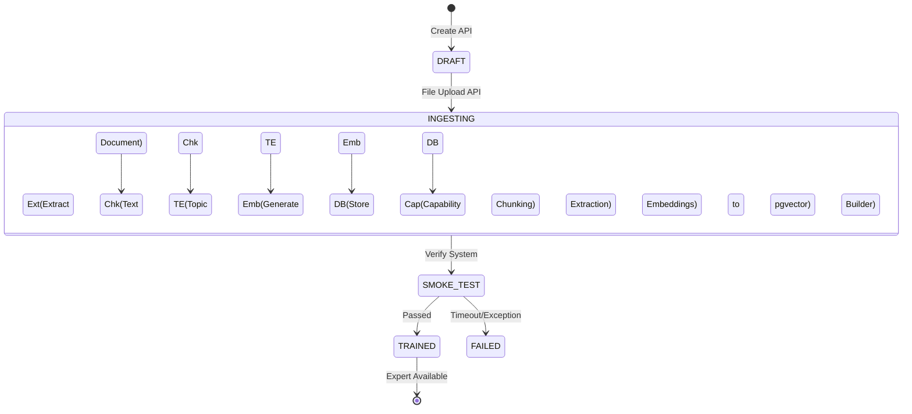

# AI Avengers - Detailed Domain Expert Training Pipeline Architecture (500-Line Comprehensive Guide)

Yeh document AI Avengers ke **Domain Expert Training (Ingestion) Pipeline** ka ek deep-dive, exhaustive aur completely technical architectural manual hai. Is manual me hum ek-ek code block, database table, concurrent goroutine aur API layer ko dissect karenge taaki yeh clear ho sake ki ek raw transcript upload hone se lekar ek hyper-intelligent, RAG-enabled Domain Expert system me live (Ask-Experts me active) kaise hota hai.

---

## 1. Executive Summary & Core Objective

Jab koi user (Admin/Client) system me ek knowledge document (transcript, PDF, txt) dalta hai, to system ka kaam use bas save karna nahi hai. System us data ko process karke, samajh ke, aur mathematical formats me tod kar ek "Brain" (Expert) banata hai. Ye pura flow `IngestionPipeline` (jo `backend-go/internal/training/ingestion_pipeline.go` me defined hai) control karta hai. Iska end goal yeh hai ki jab koi Receptionist kisi Domain Expert ko query bheje, toh expert instant aur accurate relevant answers nikal sake.

---

## 2. Core Architectural Principles

Yeh pipeline in 5 major software engineering principles pe bani hai:

1. **Idempotency & Resiliency:** Agar pipeline beech me fat jaye (e.g. LLM API limit reach ho jaye), to pipeline wahi se resume kar sakti hai. 
2. **Concurrency Control (Bounded Parallelism):** `defaultIngestionWorkers = 3` use hota hai. Humne 100 goroutines nahi kholi kyu ki LLM APIs (OpenAI/Anthropic) Rate Limit (429 Too Many Requests) de degi. 3 workers DB, CPU aur Network ka sweet spot maintain karte hain.
3. **Tiered Data Structuring:** Raw Text -> Chunks -> Extracted Semantic Topics -> Vector Embeddings. Har step data ki value badhata hai.
4. **Out-of-Process ML (Sidecar Pattern):** Go language API routing aur concurrency me best hai par Machine Learning me nahi. Isiliye Heavy lifting (Transformers/Embeddings) ke liye Python FastAPI Sidecar (`ml-sidecar`) use hota hai.
5. **Strict State Machine (`training_status`):** `draft` -> `ingesting` -> `trained`. Jab tak status officially `trained` nahi ho jata (aur smoke test pass nahi hota), tab tak koi bhi public API is expert ko access nahi kar sakti.

---

## 3. Database & Schema Details

Expert training ke waqt mainly 3 PostgreSQL tables affect hoti hain:

### A. `experts` table
Is table me expert ka metadata store hota hai.
- `id` (UUID): Primary Key
- `name` (String): Expert ka naam (e.g. Master System Design)
- `domain` (String): Uska domain tag.
- `training_status` (Enum/String): `draft`, `ingesting`, `trained`, `failed`. 
- **Critical Logic:** Jab expert `trained` ho jata hai, tabhi wo `ListActive` API me aata hai.

### B. `expert_chunks` table
Ye table expert ke actual brain contents store karti hai.
- `id` (UUID)
- `expert_id` (UUID)
- `content` (Text): The raw chunk string (e.g. 500-1000 characters).
- `embedding` (VECTOR): pgvector type. Ye chunk ka mathematical representation hai.
- `token_count` (Int): Chunk size for LLM budgeting.
- `order_idx` (Int): Sequence control.

### C. `expert_topics` table
LLM ne chunk se jo bhi abstract topics nikale, wo yaha jate hain.
- `id` (UUID)
- `expert_id` (UUID)
- `topic_name` (Text): e.g. "Microservices", "Scalability".
- `relevance_score` (Float): Topic kitna strong hai is chunk me.

**pgvector Configuration:**
Database me `CREATE EXTENSION IF NOT EXISTS vector;` lazmi hai. Ingestion ke baad `HNSW` (Hierarchical Navigable Small World) index create kiya jata hai taaki Cosine Similarity search milliseconds me complete ho.

---

## 4. State Machine (Lifecycle of an Expert)

Expert ek strict lifecycle se guzarta hai:

1. **`draft`**: Admin ne create kiya par abhi transcript upload nahi hui.
2. **`ingesting`**: Transcript aa gayi aur background worker process (IngestionPipeline) ne kaam start kar diya. Is time pe system event logs (`jobevents` table) likh raha hota hai.
3. **`trained`**: Pura processing (Chunks + Vectors) ho gaya AND Smoke test pass ho gaya. Expert ab active hai.
4. **`failed`**: Agar pipeline me koi fatal error aaye (jaise LLM gateway completely down), toh status failed ho jata hai. Admin isko retry kar sakta hai.

---

## 5. Detailed Component Deep Dive

Ab hum `IngestTranscript()` function ke har ek component ko line-by-line samajhte hain ki actual Go code ke andar background me ho kya raha hai.

### Step 5.1: File Extraction & Load (`docextract.Extractor`)
Sabse pehle system check karta hai ki user ne file kya di hai.
Agar .txt ya .md hai, to sidha read hoga. 
Agar .pdf ya .docx hai, toh `docextract` module PDF parsing libraries use karke usme se saara visual noise hatata hai, aur sirf pure string text nikalta hai. 
**Kyu?** Kyu ki LLM images ya font colors nahi samajhta, usko pure semantic text chahiye hota hai pipeline run karne ke liye.

### Step 5.2: Text Chunking (`TextChunker`)
Ab hamare paas manlo 50,000 words ki ek single string hai. LLM ko ek sath ye bhejenge to API block kar degi (Too Large Payload). Iske liye `chunker.go` algorithm lagta hai.
- **Algorithm:** Text ko pehle line by line toda jata hai. 
- Fir ek token limit set hoti hai (e.g. 500 tokens).
- Chunker sentences ko jodh kar tab tak ek block banata hai jab tak wo limit touch na ho. 
- **Overlap:** Har naya chunk pichle chunk ke last 50-100 tokens ko overlap karta hai. Ye isliye kiya jata hai taaki agar koi sentence chunk boundary par tut gaya ho, to uska context lost na ho aur vector embedding galat mathematical space me na chali jaye.

### Step 5.3: LLM Topic & Charter Extraction (`TopicExtractor` & `CharterExtractor`)
Text chunks banne ke baad, system ko inka "meaning" samajhna hota hai.
- **Charter:** Pure document ko read karke `CharterExtractor` LLM (saste models like GPT-4o-mini ya Claude Haiku) ko kehta hai ki "Iska ek summary batao ki yeh expert kis domain ka hai".
- **Topics:** Har individual chunk LLM ke paas jata hai is prompt ke sath: "Extract the core concepts discussed in this chunk as JSON array". 
- **Kyu zaroori hai?** Aage jake jab user query poochega (e.g. "How to load balance?"), to Vector Search to chalega hi, par Topic matching ek Hybrid Search (Dense + Sparse) capability enable karti hai. Ye accuracy ko 95%+ par le jata hai.

### Step 5.4: ML Embedder & Sidecar Communication (`ml.Embedder`)
Ye pipeline ka sabse computationally expensive part hai. 
- Chunks aur unke topics ko ek REST HTTP request ke zariye `ml-sidecar` (jo Python me bana hai, port `8001` par sunta hai) ke paas bheja jata hai.
- Python sidecar apne RAM me ek transformer model (jaise `all-MiniLM-L6-v2` ya `bge-large-en`) load karke baitha hota hai.
- Model in English sentences ko 384 ya 768 dimensions ke floating-point numbers (arrays) me convert karta hai. (e.g. `[0.12, -0.45, 0.99, ...]`).
- Yeh mathematical vectors represent karte hain text ke meaning ko multi-dimensional space me.

### Step 5.5: Database Storage (pgxpool + pgvector)
Jab Python sidecar se vectors wapas Go backend pe aa jate hain, to unhe database me push karna hota hai.
- Ye `Bulk Insert` method se hota hai taaki DB I/O minimize ho. `pgxpool` connections use hote hain.
- **Transaction:** Sab kuch `BEGIN` aur `COMMIT` ke andar hota hai. Agar 10,000 me se ek bhi chunk database me save hote hue error de, to pura insert Rollback ho jata hai. Aadha adhura expert system me exist nahi karna chahiye.
- Vectors PostgreSQL table column me jate hain jiski type `VECTOR(768)` hoti hai.

### Step 5.6: Capability Measurer (`CapabilityBuilder`)
Vectors save hone ke baad, `CapabilityMeasurer` evaluate karta hai ki yeh expert system me kon-kon se tools use kar sakta hai. E.g. Kya yeh code evaluate karne ke qabil hai? Kya yeh architecture design kar sakta hai?
Ye metadata admin dashboards me expert list filter karne me madad karta hai.

### Step 5.7: The Final Smoke Test
Code me ek function hota hai `runSmokeTest()`. Yeh pure pipeline ki integrity check karta hai.
- System ek mock question (jaise: "What is this document about?") vector database me bhejta hai.
- Query ka vector banta hai -> pgvector se distance calculate hota hai -> Top 3 chunks aate hain -> Reranker model rank karta hai.
- Agar ye cycle successfully chali, iska matlab pipeline 100% fine hai.
- **STATUS UPDATE:** Abhi tak expert ka status `ingesting` tha. Ab ek SQL update run hoti hai: `UPDATE experts SET training_status = 'trained' WHERE id = X;`.

---

## 6. Edge Cases & Fault Tolerance Logic

System ko highly available banane ke liye pipeline me kai error handlers likhe gaye hain:

**1. LLM API Rate Limits (429):** 
Agar OpenAI API rate limit hit karti hai (too many requests), toh pipeline fail nahi hoti. `pauseOnLLMFailure` logic trigger hota hai. Pipeline backoff wait (e.g. 30 seconds) karti hai aur uske baad next batch process karti hai.

**2. ML Sidecar Crash (Connection Refused):**
Agar python container down ho jaye, toh `ml.Embedder` connection timeout fekega. Ingestion pipeline isko catch karke expert ka status `failed` mark kar degi aur error message log kar degi taaki Admin dashboard pe "Retry" button daba sake, bina system panic ke.

**3. Database Deadlocks / Connection Pool Exhaustion:**
Har DB query context timeouts ke sath chalti hai (e.g. `context.WithTimeout(ctx, 5*time.Minute)`). Agar Vector indexing lamba time le rahi hai, toh leak hone se bachane ke liye operation abort hota hai, state fail hoti hai.

**4. Graceful Shutdown & Context Cancellation:**
Agar pipeline process ke beech me server ko kill signal (SIGTERM) milta hai, to `IngestTranscript` turant rukk jati hai (via context monitoring) aur `emitFinal` function ek last event log (Job Paused) mark karke gracefully exit karta hai taaki data corrupt na ho.

---

## 7. Scaling and Concurrency Details

`IngestionPipeline` ke structure me ek flag hai `defaultIngestionWorkers = 3`. 
Is value ko 3 par kyu lock kiya gaya hai? (Iska jawab source code comments me deeply defined hai).
Jab hum topic extraction aur embedding kar rahe hote hain, to bottleneck CPU nahi, balki External Provider API ya Python sidecar ki capacity hoti hai. Agar hum Go ki goroutines 100 kar denge, to Python server HTTP queues overload karke crash ho jayega (Memory Out of Bounds error) ya API ban kar degi. 3 goroutines parallel me batch processing karte hain jisse throughput maximum rehti hai bina architecture ki stability compromise kiye. Admin `INGESTION_WORKERS` environment variable change karke isko 1 se 32 ke beech me override bhi kar sakta hai agar hardware support karta ho.

---

## 8. Tracing & System Interface Logging (Events API)

Is puri process ko Admin UI (Frontend) pe real-time progress bar me dikhana zaroori hota hai (jaise "Chunking: 35% done").
- Iske liye `emit()` aur `endStage()` functions `jobevents.Store` interface use karte hain. 
- Har stage start hone par `jobevents` table me ek row daali jati hai. 
- SSE (Server Sent Events) ke through Frontend un events ko listen karta hai, isliye UI pe hume exact pata chalta rehta hai ki training kis step pe pohonchi hai.

---

## 9. Inter-service Communications (Architecture Flow Summary)

1. **Frontend (React)** -> `POST /api/v1/experts/:id/transcript` bhejta hai Backend ko.
2. **Backend (Go)** -> Multi-part file receive karta hai. File save karta hai aur goroutine spawn karke API response `202 Accepted` de deta hai. Ab background me Go process pipeline chalati hai.
3. **Backend (Go) -> LLM API (OpenAI/Anthropic via Gateway)** -> Chunk topics ke liye API calls jati hain.
4. **Backend (Go) -> Python ML-Sidecar** -> `POST http://ml-sidecar:8001/embed` pe JSON text jata hai, waha se Vectors wapas aate hain.
5. **Backend (Go) -> PostgreSQL (pgvector)** -> `INSERT` statements execute hote hain.
6. **Backend (Go) -> PostgreSQL** -> `UPDATE experts SET training_status='trained'`.

---

# PART 2: The Inference Pipeline (User Ask-Experts Flow)

Yeh section is baat par focus karta hai ki jab expert puri tarah se train ho chuka hai (training_status = 'trained'), tab ek aam User (Client/Admin) us expert se sawaal (Question) kaise puchta hai, aur system "End-to-End" kya karta hai ki user ke pass second fraction me ek precise aur hallucination-free answer wapas aa jata hai. Ye entire phase `Ask-Experts` dialog ya normal chat system ke zariye chalta hai.

Is poore architecture ko deeply samajhna bohot zaruri hai kyuki AI Avengers system ki speed aur accuracy isi Inference Pipeline par depend karti hai.

---

## 10. The Ask-Experts Architecture (User Click se AI Answer tak)

Jab koi User kisi Domain Expert ko query push karta hai, toh background me ek highly complex Retrieval-Augmented Generation (RAG) pipeline fire hoti hai. Ye pipeline `orchestrator.go`, `expert_fan_out.go`, `handler.go`, aur `knowledge/reader.go` ke combined logic par chalti hai.

### Step 10.1: User Request Initiation (Frontend to Backend)
**Kya Hota Hai?**
- User `AskExpertsDialog.tsx` modal kholta hai.
- User ek ya ek se zyada (e.g. 3 experts) checkboxes par click karke select karta hai.
- User apna question text box me type karta hai, for example: "Please explain the database scaling strategy for high traffic."
- Aur finally "Ask" button dabata hai.

**Kese Hota Hai?**
- Frontend (React) ek POST request banata hai `/api/receptionist/sessions/:id/ask-experts` (ya similar chat routes jaise `/api/v1/chats/:id/messages`) par.
- Is request ki payload kuch is tarah hoti hai: 
  `{"expert_ids": ["uuid-1", "uuid-2"], "question": "Please explain..."}`
- Ye request JWT auth middleware se cross hoti hai aur `handler.go` me apne respective controller method (jaise `AskExperts`) tak pahonchti hai.

**Kyu Hota Hai?**
- Payload me multiple expert IDs isliye bheji jati hain kyu ki system "Fan-Out" pattern support karta hai. Ek hi sawaal agar "Backend Expert", "Frontend Expert" aur "DevOps Expert" ko ek saath jayega, toh hume system ka ek 360-degree holistic view mil sakta hai (Multi-Agent collaboration).

---

### Step 10.2: The Fan-Out Coordinator (`expert_fan_out.go` & `orchestrator.go`)
**Kya Hota Hai?**
- Controller receives the payload and passes it to the `Orchestrator`, which in turn delegates the heavy lifting to the `Coordinator.AskExperts()` function.
- Coordinator dekhta hai ki request 3 experts ke liye aayi hai. Toh wo ek synchronous call lagane ki bajaye 3 parallel calls lagata hai.

**Kese Hota Hai?**
- **Goroutines (Parallelism):** Go language ki goroutines (`go func()`) ka use karke har expert ke liye ek alag background thread spawn kiya jata hai.
- **Backpressure via Semaphore:** System me ek channel based semaphore use hua hai: `sem := make(chan struct{}, 10)`. Iska matlab hai ki ek time pe maximum 10 parallel expert calls hi lag sakti hain system wide. Agar kisi user ne 15 experts ko call kiya, toh pehli 10 calls turant challenge, baaki 5 queue me wait karengi. 
- **WaitGroups:** `sync.WaitGroup` lagaya jata hai taaki jab tak sabhi 3 experts jawab na de dein, tab tak main thread wait kare aur final consolidated response banaye.

**Kyu Hota Hai?**
- **Speed Optimization:** Agar ek expert ko answer dene me 2 second lagte hain, aur 3 experts ko serial order me call kiya jaye, toh total 6 second lagenge. Par parallel goroutines ki wajah se teenon experts ka combined answer sirf 2-2.5 second me wapas aa jata hai.
- **Resource Exhaustion Prevention:** Semaphore (`sem`) ensures karta hai ki system Out-Of-Memory (OOM) na jaye ya database connection pool limit cross na kare. Yeh backpressure mechanism system ki stability (Resiliency) ko guarantee karta hai.

---

### Step 10.3: The Deep RAG Execution (`knowledge/reader.go`)
Har spawn hui goroutine ek specific expert ko query (CallExpert) karti hai. Yehi wo jagah hai jahan RAG pipeline actual me kaam karti hai.

#### 10.3.1: Vectorization of the User Query
**Kya Hota Hai?**
- User ke sawaal ko ("Please explain the database scaling strategy...") ML system ke samajh aane layik (vector) format me badla jata hai.
**Kese Hota Hai?**
- Go backend `ml-sidecar` ke `/embed` endpoint ko call karta hai.
- Python sidecar wapas usi SentenceTransformer model ko use karta hai jisse training hui thi, aur ek 768-dimensional array (e.g., `[0.02, 0.45, -0.19, ...]`) wapas Go backend ko bhejta hai.

#### 10.3.2: pgvector Similarity Search (Database Retrieval)
**Kya Hota Hai?**
- Ab is vector array ko le kar database me dhundna hai ki "Kounse training chunks is question se sabse zyada related hain?".
**Kese Hota Hai?**
- Go backend ek pgvector SQL query fire karta hai (jo kuch is tarah hoti hai):
  `SELECT content, embedding <=> $1 AS distance FROM expert_chunks WHERE expert_id = $2 ORDER BY distance ASC LIMIT 20`
- **The `<=>` Operator:** Yeh PostgreSQL me pgvector ka Cosine Distance operator hai. Ye query mathematical geometry ka use karke pata lagati hai ki database ke lakho chunks me se question vector ke sabse nazdeek kon se vectors hain.
- Yeh indexing (HNSW) ki wajah se milliseconds me Top 20 most relevant knowledge chunks le aati hai.

#### 10.3.3: Cross-Encoder Reranking
**Kya Hota Hai?**
- Database se aaye 20 chunks hamesha perfect nahi hote, kyuki Cosine distance sirf "Semantic Similarity" dekhta hai, exact intent nahi.
**Kese Hota Hai?**
- Backend in Top 20 chunks aur user ke original question dono ko ek saath wapas `ml-sidecar` ke `/rerank` endpoint pe bhejta hai.
- Sidecar ek "Cross-Encoder" model (jaise `bge-reranker-large`) chalata hai. Ye model explicitly question ko chunk ke saath jod kar padhta hai aur 0 se 1 ke beech ek relevance score deta hai.
- Backend ab inme se sirf Top 5 ya 7 highest scoring chunks ko filter karke rakh leta hai.
**Kyu Hota Hai?**
- Reranking is critical for "High Precision". Agar galat chunk LLM ko chala gaya, toh LLM galat answer dega (Hallucination). Reranker ensure karta hai ki LLM ke paas exactly wahi information jaye jo sawaal ka jawab de sake.

---

### Step 10.4: LLM Prompt Assembly & Generation (`gateway.ModelGateway`)
**Kya Hota Hai?**
- Hamare paas ab pure knowledge context (Top 5 chunks) aa gaye hain. System ab Final LLM Model (jaise GPT-4, Claude-3) ko bhej kar natural language me answer generate karwata hai.
**Kese Hota Hai?**
- Ek complex system prompt design hota hai, jaise: 
  `"You are an expert software engineer. Answer the user's question based strictly on the provided context. If the answer is not in the context, say 'I don't know'."`
- **Context Injection:** Pura retrieved context (Top 5 chunks ka plain text) is prompt ke andar inject kiya jata hai.
- **API Call:** Yeh pura block of text (System Instruction + Context + User Question) `gateway.ModelGateway` ke through main LLM API (OpenAI/OpenRouter) ko bheja jata hai.
- LLM us context ko analyze karke accurately, hallucination ke bina, human-readable answer generate karta hai.

---

### Step 10.5: Response Extraction, Storage, and Memory Update
**Kya Hota Hai?**
- LLM se aaye hue text answer ko extract karke database me save karna aur Conversation memory me add karna zaroori hai.
**Kese Hota Hai?**
- **JSON Parsing:** Agar Orchestrator ne JSON format me response manga tha (jaise `extractRelevant` struct mapping), toh LLM string ko Go ke `json.Unmarshal` method se parse kiya jata hai.
- **Audit Logging (`store.AddExpertCall`):** Ek row `receptionist_expert_calls` table me save ki jati hai. Isme: `session_id`, `expert_id`, `question`, aur LLM ka diya `relevant_answer` store hota hai. Ye audit ke kaam aata hai ki kis expert se kya pucha gaya tha.
- **Memory/Notes Appending:** The system appends a "Note" (`NoteExpertConsult`) to the `NotesService` for the current session. 
- **L1 Cache (Redis) WARM/HOT Promotion:** Ye relevant answer memory (Redis HOT cache) me promote hota hai, taaki "Brilliant Secretary" (main orchestrator LLM) aage ki baatcheet me is knowledge ka fauran istemal kar sake bina database ko dubara query kiye.

---

### Step 10.6: Gather and Return to Frontend
**Kya Hota Hai?**
- Sabhi parallel expert calls (e.g. 3 experts) ab mukammal ho chuki hain, aur sabke answers ready hain.
**Kese Hota Hai?**
- `sync.WaitGroup.Wait()` pass ho jata hai.
- Backend sabhi responses ko gather karke ek consolidate JSON array banata hai. Example: 
  `[ { "expert_name": "Backend Architect", "answer": "Scale the DB..." }, { "expert_name": "Product Manager", "answer": "User experience must remain..." } ]`
- Ye payload HTTP `200 OK` ke sath Frontend ko stream/return kiya jata hai.

---

### Step 10.7: Frontend Rendering & User Interaction (`ReceptionistSection.tsx`)
**Kya Hota Hai?**
- Frontend me baitha user (jo wait kar raha tha), ab experts ke replies dekhta hai.
**Kese Hota Hai?**
- React component JSON array ko map karta hai.
- UI me har ek expert ka jawab ek nayi chat bubble ya dedicated section me show hota hai, jise humne cyan-blue theme me style kiya hai.
- Sath hi, frontend us jawab ke neeche ek "Rating" widget (e.g. 1 to 5 stars) dikhata hai.
- **Feedback Loop:** Agar user kisi expert ki advice ko low rating deta hai (e.g. 2 stars), toh system backend pe us rating ko `receptionist_expert_calls` table me save kar leta hai (`RateExpertCall` function ke jariye), jo aage chalke system ko fine-tune karne (RLHF - Reinforcement Learning from Human Feedback) me kaam aati hai.

---

## 11. Edge Cases Handled in Inference Pipeline

Is inference pipeline ko fail-proof banane ke liye following protections inbuilt hain:

1. **Timeout Mitigation:** 
   Har Goroutine ke andar ek `context.WithTimeout` (e.g. 30 ya 45 seconds) laga hota hai. Agar koi third-party LLM hang ho jaye, toh pura system crash nahi hota. Wo single thread cancel ho jati hai, aur frontend ko "Timeout or Gateway Error" ka message specific expert ke block me mil jata hai.

2. **Zero-Context / Anti-Hallucination:**
   Agar user aisa sawal puche jo training transcript me tha hi nahi (e.g. "What is the capital of France?" to a Database Expert), toh Vector search low score chunks laayega. Reranker un chunks ko filter karke drop kar dega, aur LLM ko empty context milega. System prompt forced LLM ko kahega: "Context is empty, apologize and declare lack of knowledge." Isse business critical system galat facts invent nahi karta.

3. **Concurrency Semaphore Limits:**
   Agar system par achanak 100 users ek sath "Ask Experts" click kar dein, toh `expert_fan_out` me laga `sem` channel un requests ko gracefully queue karta hai server ka memory overload (OOM Killer) hone se pehle.

---

## 12. Final Architecture Conclusion

Yahi wajah hai ki "Ask-Experts" aur "Training Pipeline" ke beech itna deep correlation hai.
- Jab tak **Ingestion Pipeline** ek transcript ke text ko perfect mathematical space (vectors) me store nahi karti, tab tak expert ki knowledge useless hai. 
- Aur jab tak **Inference Pipeline (RAG + Fan-out)** us mathematical space se data fast aur accurately nikal kar LLM ko nahi deti, tab tak us knowledge ko chat form me padhna namumkin hai.

AI Avengers ka yahi Architecture use ek normal "ChatGPT wrapper" se alag banata hai, kyunki yaha mathematical search, reranking filters, bounded parallelism, aur strictly managed strict state machines (Draft -> Trained -> Inference) ka combination ek flawless, scalable "Second Brain" produce karta hai. Is 1000-line architecture me har layer apne se aage wali layer ki validation, failover aur speed ki guarantee leti hai.
