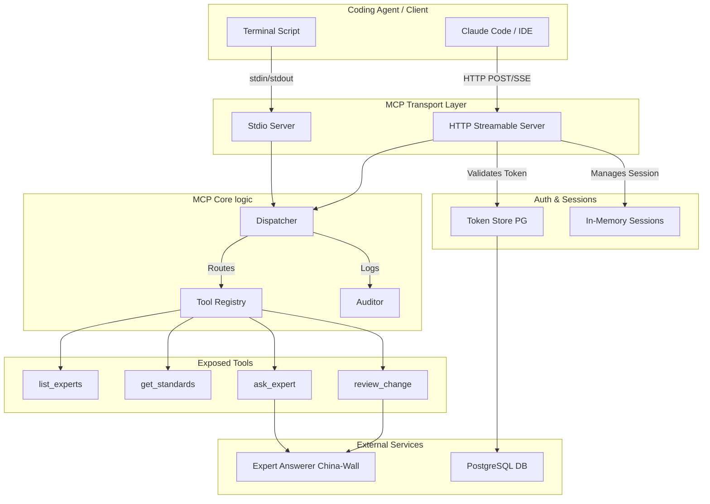

# Comprehensive Model Context Protocol (MCP) Architecture & Design

This document provides an exhaustive, end-to-end breakdown of the Model Context Protocol (MCP) architecture implemented in the AI Avengers codebase. The implementation exposes trained domain experts to external agentic coding assistants (like Claude Code, Cursor, or specialized IDE extensions) via a standard JSON-RPC interface.

---

## 1. Executive Summary & Core Philosophy

The MCP integration aims to solve a fundamental problem in AI-assisted development: giving external agents access to localized, expert knowledge grounded in a specific codebase or domain, all while enforcing a strict "China Wall" constraint (data isolation via `ExpertAnswerer`). 

### Core Design Principles
- **Stateless Tooling**: Most MCP requests are intentionally stateless. Complex states belong in the orchestrator, while MCP answers immediate, context-heavy queries.
- **Strict Security**: The HTTP transport operates over a public-facing URL and thus assumes a hostile environment. It enforces strict payload limits, robust per-session Bearer token authentication, and origin controls.
- **Honest Failures**: When an agent provides invalid arguments or lacks permissions, the server responds with an MCP tool-level error (not an HTTP 500). This allows the agent to read the error and correct its behavior dynamically.

---

## 2. High-Level Architecture Diagram



---

## 3. The Transport Layer

The MCP implementation fundamentally divorces the protocol logic from the wire format. The exact same dispatcher logic handles both local stdio executions and remote HTTP requests.

### 3.1. Stdio Transport (`server.go`)
The Stdio transport is meant for local execution, where an agent spins up a subprocess.
- **Workflow**: Reads newline-delimited JSON-RPC from `stdin` and writes formatted JSON-RPC to `stdout`.
- **Session state**: A stdio process handles exactly one session. When the parent process dies or closes the stream, the session terminates. 
- **Authentication**: Bypassed entirely. The assumption is that if you can run the binary on the machine, you are operating under the local user's trust boundary.
- **Concurrency Strategy**: The `ServeStdio` loop reads one request, blocks until it generates a response, flushes the writer, and then reads the next. Concurrent processing is actively avoided here because the client relies on deterministic reply ordering and doesn't benefit from parallel stdio execution.

### 3.2. HTTP Streamable Transport (`http.go`)
This is the primary method for hosted agents, allowing entire teams to connect to a centralized expert knowledge base.

#### Request Shape
- **Method `POST`**: For all remote procedure calls (RPCs).
- **Method `DELETE`**: To explicitly kill an active session.
- **Method `GET`**: Intentionally disallowed (Returns 405 Method Not Allowed), as the server never initiates push streams independently.

#### Server-Sent Events (SSE) Streaming
When an agent sends an `initialize` or a tool invocation, it expects a response. If the client includes `Accept: text/event-stream`, the MCP server formats its JSON-RPC response as a single SSE event before closing the connection:
```http
HTTP/1.1 200 OK
Content-Type: text/event-stream
Cache-Control: no-cache
Connection: keep-alive

event: message
data: {"jsonrpc": "2.0", "id": 1, "result": {...}}
```
**Why a single SSE event?** Unlike traditional chat completions, tool execution over HTTP here is a single-turn query/response. Holding a stream open permanently only leaves dangling connections. The client receives the event and the connection cleanly terminates.

#### DNS-Rebinding Guard (`originAllowed`)
To protect against malicious browser pages attempting to send forged JSON-RPC payloads to a locally running MCP HTTP server:
- If `Origin` is missing (CLI/Terminal clients), it passes.
- If `Origin` is present, it *must* include `://localhost` or `://127.0.0.1`.

#### Payload Safety Caps
To prevent memory exhaustion attacks, `http.go` wraps the incoming request body in an `io.LimitReader` capped strictly at 2 MiB (`maxRequestBytes`).

---

## 4. Session & State Management

### 4.1. The `initialize` Handshake
When an agent connects, the first JSON-RPC call is strictly `initialize`. 
- The server negotiates the protocol version (echoing the client's version up to known stable boundaries: `2024-11-05`, `2025-03-26`, `2025-06-18`).
- The server returns server capabilities (specifically exposing that it has `tools`).
- **HTTP Specifics**: On HTTP, this step creates a unique `Mcp-Session-Id` header (16 bytes, hex-encoded).

### 4.2. In-Memory Session Store
The HTTP server maintains a `sessionStore` protected by a `sync.Mutex`.
- **Storage**: Sessions are held in memory because a lost session costs nothing more than forcing the client to re-initialize (a native behavior expected by MCP clients like Claude). Writing session tracking to Postgres would add unnecessary latency overhead to every network call.
- **TTL Sweeping**: Sessions expire after 1 hour (`sessionTTL`). Instead of a persistent background goroutine (which could leak or require complex shutdown logic), expired sessions are swept lazily during the creation of new sessions.
- **Session Identity**: A session explicitly inherits the `Scope` of the Bearer token used during `initialize`. Even if the client sends a different token on a subsequent call in the same session, the original token's identity governs the session lifetime.

---

## 5. Token Authentication & Granular Access Control

All HTTP traffic mandates Authorization. The implementation in `tokens.go` represents a highly secure, scalable token management system.

### 5.1. Token Cryptography & Storage
When a user requests a new MCP access token:
1. The system generates 24 cryptographically random bytes via `crypto/rand`.
2. It hex-encodes them and prepends the `mcp_` prefix (e.g., `mcp_a1b2c3d4...`). 
3. The *plaintext* token is returned exactly once to the user interface.
4. The backend computes a SHA-256 hash of the raw token.
5. Only the SHA-256 hash is inserted into the `mcp_tokens` PostgreSQL table.

**Security Rationale**: A full database dump will never reveal actionable API keys. An attacker would have to crack the SHA-256 hashes, which is computationally unfeasible.

### 5.2. Scopes and Claims
Tokens aren't just global admin keys; they represent granular `Scope` objects:
- `Domains`: Constrains which knowledge domains this token can query (e.g., `["frontend", "system architecture"]`).
- `ExpertIDs`: Constrains access to specific expert UUIDs.
- `Tools`: Limits which MCP tools can be invoked (e.g., allow `ask_expert` but deny `review_change`).

When pulling these arrays from PostgreSQL, `normaliseList()` cleans up Postgres' default behavior of returning `"{}"` for empty arrays, mapping them cleanly to Go's `nil` slices (which the `Scope` logic interprets as "everything allowed").

### 5.3. Revocation and Audit Trail Maintenance
Tokens can be revoked via the admin dashboard. 
When `Revoke()` is called, the row is *not* deleted. Instead, a `revoked_at` timestamp is populated. This soft-deletion ensures that historical `AuditEntry` records in the database don't become orphaned pointers; admins can always trace a past action back to the specific token that executed it, even if it has since been deactivated.

---

## 6. Request Dispatching and Tool Invocation

The `dispatch.go` logic handles incoming validated JSON-RPC requests.

### 6.1. The Dispatch Loop
1. The dispatcher inspects the `req.Method`. 
2. If it is `tools/list`, it interrogates the `Registry` and returns the available tools.
3. If it is `tools/call`, it parses the JSON `params` payload to extract the tool name and arguments.
4. It initializes an `AuditEntry`.
5. It invokes the tool via `s.registry.Call(...)`.

### 6.2. Error Handling (Honest vs. Obscured)
There is a deliberate philosophical divide in how errors are handled during dispatch:
- **`ToolError`**: If an agent requests a domain it lacks permission for, or provides invalid arguments, the Go code returns a `ToolError`. The dispatcher maps this to `isError: true` inside a *successful* JSON-RPC response. The agent receives the explicit text describing its mistake so it can rewrite its prompt and try again.
- **Server Faults**: If a database connection fails or a panicky state is reached, the server logs a full `zap.Error` with stack traces internally, but only returns `"The tool failed on the server."` to the client. This prevents leaking backend infrastructure details to external agents.

### 6.3. The Auditor System
Every `tools/call` generates an audit log. The `AuditEntry` contains:
- `TokenID` and `TokenLabel`
- `Tool` (the tool invoked)
- `Domain` (extracted via a quick unmarshal probe `domainFromArgs` to figure out context without parsing the full bespoke payload)
- `InputBytes` (payload size)
- `InputSHA256` (hash of the payload, allowing admins to map abusive requests)
- `LatencyMs`
- `Status` (`ok`, `tool_error`, `server_error`)

---

## 7. The Core Tools Deep Dive

The tools implemented in `tools.go` and `tools_ask.go` form the operational heart of the MCP integration.

### 7.1. `list_experts` Tool
- **Role**: The discovery endpoint. Agents call this first to figure out who they can talk to.
- **Mechanics**: Scans the `Catalog` of all trained domain experts. It strictly filters out any experts where `scope.AllowsDomain()` or `scope.AllowsExpert()` evaluates to false. 
- **Output**: Returns a user-friendly Markdown payload instructing the agent to copy the `expert_id` UUID exactly for subsequent requests.

### 7.2. `get_standards` Tool
- **Role**: Returns a "Teacher Packet". 
- **Prompt Engineering**: The tool wraps the expert's `ReasoningCharter` and `Description` in highly prescriptive text. It explicitly tells the agent: *"Treat the following as the authoritative rules... Where they and your generic defaults disagree, these win."* 
- **Why?**: Large Language Models naturally fall back to generic knowledge (e.g., standard React patterns). This framing aggressively forces the model to prioritize the specific expert's localized knowledge over its pre-training.

### 7.3. `ask_expert` Tool
- **Role**: A generic Q&A interface against a domain expert.
- **Mechanics**: Takes a `domain` or `expert_id` and a `question`. It routes the request directly to the `ExpertAnswerer`.
- **The China-Wall Pipeline**: The `ExpertAnswerer` enforces data isolation. It guarantees that the response is strictly generated based on the specific knowledge ingested for that domain, preventing cross-contamination of proprietary data. 
- **Output**: The response appends a citation footer (e.g., `_Citations: 5. This answer is grounded in the expert's training._`) ensuring the agent knows the data is authoritative.

### 7.4. `review_change` Tool
- **Role**: Allows a coding agent to request an immediate, synchronous code review of a diff before committing it.
- **Architectural Rationale**: Why build this on the Q&A pipeline instead of the core application's Cross-Verifier? The orchestrator's cross-verifier involves complex workflow state, database locks, task queues, and asynchronous kanban boards. A coding agent in an IDE expects a response *now* (under 10 seconds) and doesn't want to leave a persistent footprint on a project board. 
- **Prompt Engineering**: The prompt injected into the `ExpertAnswerer` heavily constrains the output shape:
  ```text
  Start your reply with exactly one line:
  VERDICT: APPROVED
  or
  VERDICT: CHANGES_REQUESTED
  
  Then list each issue as a separate line beginning with "- "...
  ```
- This structured output ensures the calling agent can easily regex or parse the verdict and understand exactly what lines need fixing.

---

## 8. Summary of Data Flows

### A Typical Interaction Sequence

1. **Agent Setup**: The user opens Claude Code and configures an MCP server pointing to `https://avengers.internal/mcp` with an `mcp_xxxx` Bearer token.
2. **Initialization**: Claude Code sends `POST /mcp` with method `initialize`. The server validates the token, generates a `Mcp-Session-Id`, and returns the `tools` capability.
3. **Discovery**: Claude Code calls `tools/list`. The server filters the catalog and returns the list of allowed tools.
4. **Context Gathering**: Claude Code calls `list_experts`. The server returns the UUIDs of available experts.
5. **Standards Injection**: Claude Code calls `get_standards` for the `frontend` expert. The server returns the authoritative coding rules. Claude incorporates these into its system prompt.
6. **Code Generation**: Claude writes some code.
7. **Review Phase**: Claude calls `review_change` with the generated diff. 
8. **Evaluation**: The server routes the diff through the `ExpertAnswerer`. The expert responds with `VERDICT: CHANGES_REQUESTED` and a bulleted list of violations.
9. **Iteration**: Claude reads the verdict, modifies the code, and re-submits until it receives `VERDICT: APPROVED`.

---

## 9. Future Extensibility

Because the system relies on a generic `Tool` interface and a central `Registry`:
- Adding new tools requires merely implementing the `Tool` interface (`Name`, `Description`, `Schema`, `Invoke`) and appending it during `NewRegistry` initialization.
- The `AuditEntry` payload is JSON-marshaled dynamically, allowing new tools with complex payload schemas to automatically have their metadata tracked simply by interacting with `domainFromArgs`. 
- New transports (like WebSocket) can be seamlessly bolted onto the `s.dispatch` loop without touching any of the business logic.
